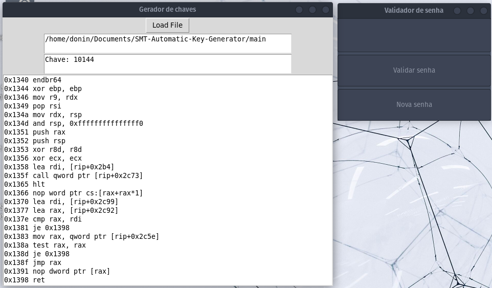
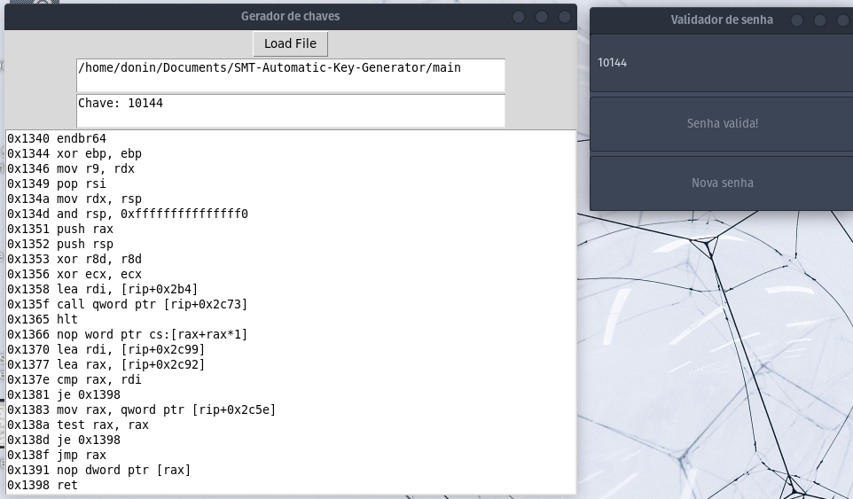

# Gerador de Chaves Presentes em Instruções de Máquina por Teoria de Satisfabilidade do Módulo 

### ABSTRACT
This project uses Satisfiability Modulo Theories (SMT) to automatically generate access
keys through binary file analysis. The Binary Analysis and Reverse Engineering
Framework (BARF) was used to translate machine instructions from the Intel x86 platform
into a platform-independent intermediate language, Reverse Engineering Intermediate
Language (REIL). The translated instructions are analyzed by the Z3-solver to determine
the satisfiability of constraints. If satisfactory, it prints possible assignments for the
variables ‘a’, ‘b’, and ‘c’. Preliminary results indicate the possibility of generating a
validation key by manually adding constraints to the Z3-solver. Future work focuses on
automating key generation through the analysis of instructions translated into REIL.
Research is ongoing and current challenges include compatibility issues with newer
versions of Python, necessitating technological adaptation to updated versions.
#### KEYWORDS: automatic analysis; assembly; keygen.
#### Presented remotely at SEI-SICITE 2023 - Ponta Grossa, Paraná, Brazil.
[Full Text](https://seisicite.com.br/storage/seisicite-trabalhos-finais/1132-4d557ffafdac356241b527535c5f603961c8b799c2cd472320995826e184e432.pdf)
## Overview
This project aims to investigate the application of Satisfiability Modulo Theories (SMT) to the problem of automatic key generation for access systems. The goal is to develop a system that performs reverse engineering automatically.

A key is a set of information that determines the functional output of an algorithm. Keys are typically used in different computational contexts as a form of authentication for access to resources. The access system, including its algorithm, is typically known. However, the key is kept secret by those who have access to the resource in order to validate their authentication.

## Objectives
The general objective of this research project is to investigate SMT in the problem of automatic key generation, with the goal of developing a system that performs this reverse engineering operation automatically.

Specific goals of the project include:
- Studying SMT theory and its applications
- Creating access functions that simulate real systems for testing and performance evaluation
- Programming a computational model for SMT that can be applied to these test functions
- Studying the application of SMT and its efficiency in the problem of automatic key generation
- Conducting a literature review on the state of the art in SMT applications and software reverse engineering

# Binary Analysis and Reverse Engineering Framework
This project utilizes [BARF Project](https://github.com/programa-stic/barf-project#barf--binary-analysis-and-reverse-engineering-framework) to assist in the automatic binary analysis making use of its implementation of [Z3 solver](https://github.com/Z3Prover/z3) and of [Openreil](https://github.com/Cr4sh/openreil).

## How to use
# main.c and make.sh
First install gtk dependencies, then use the script make.sh to compile and execute ./main automatically.
The program will ask you to input a password and check if it's valid.
The second button resets the program for you to test another possible password and it's validity.

# Automatic_solver.py
## BARF, Z3-SOLVER, OPENREIL
Automatic solver is a python script that uses TKinter for the GUI, when executing it, a window will be rendered
It will ask you to select an ELF or PE32 file.
After the file is loaded onto the BARF module, the instructions will be translated to OPENREIL instructions, the program will be disassembled and the instructions will be displayed in the text box in the program.
After being translated, the instructions will be analyzed with symbolic execution by z3 and if a solution is found, it will be displayed in a text box on the program with the valid password/key.

## Considerations
As of now, I only tested it with the provided ELF file "main" compiled from main.c. 
In this case the restrictions are found automatically by the code analyzer present on BARF and the restrictions are tested for Satisfiability after the translation from OPENREIL.
None of the restrictions were manually added.

## Manual_solver.py
This script is the earlier version of the one mentioned above, it doesn't use BARF nor OPENREIL, here, the restrictions are added manually to the solver, which then finds a solution.
It is tailor made for the compiled program "main" and won't work for any other executable unless the restrictions are manually added.

## SMT Automatic Key Generator by Binary Analysis 

