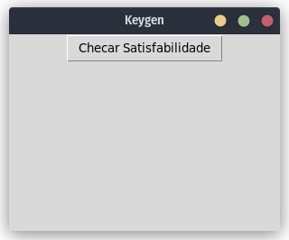

# SMT Automatic Key Generator

## Overview
This project aims to investigate the application of Satisfiability Modulo Theories (SMT) to the problem of automatic key generation for access systems. The goal is to develop a system that performs reverse engineering automatically.

A key is a set of information that determines the functional output of an algorithm. Keys are typically used in different computational contexts as a form of authentication for access to resources. The access system, including its algorithm, is typically known. However, the key is kept secret by those who have access to the resource in order to validate their authentication.

## Objectives
The general objective of this research project is to investigate SMT in the problem of automatic key generation, with the goal of developing a system that performs this reverse engineering operation automatically.

Specific goals of the project include:
- Studying SMT theory and its applications
- Creating access functions that simulate real systems for testing and performance evaluation
- Programming a computational model for SMT that can be applied to these test functions
- Studying the application of SMT and its efficiency in the problem of automatic key generation
- Conducting a literature review on the state of the art in SMT applications and software reverse engineering

## Binary Analysis and Reverse Engineering Framework
This project utilizes [BARF Project](https://github.com/programa-stic/barf-project#barf--binary-analysis-and-reverse-engineering-framework) to assist in the automatic binary analysis making use of its implementation of [Z3 solver](https://github.com/Z3Prover/z3) and of [Openreil](https://github.com/Cr4sh/openreil).

## Key Generator in Python

## Validation program in C

